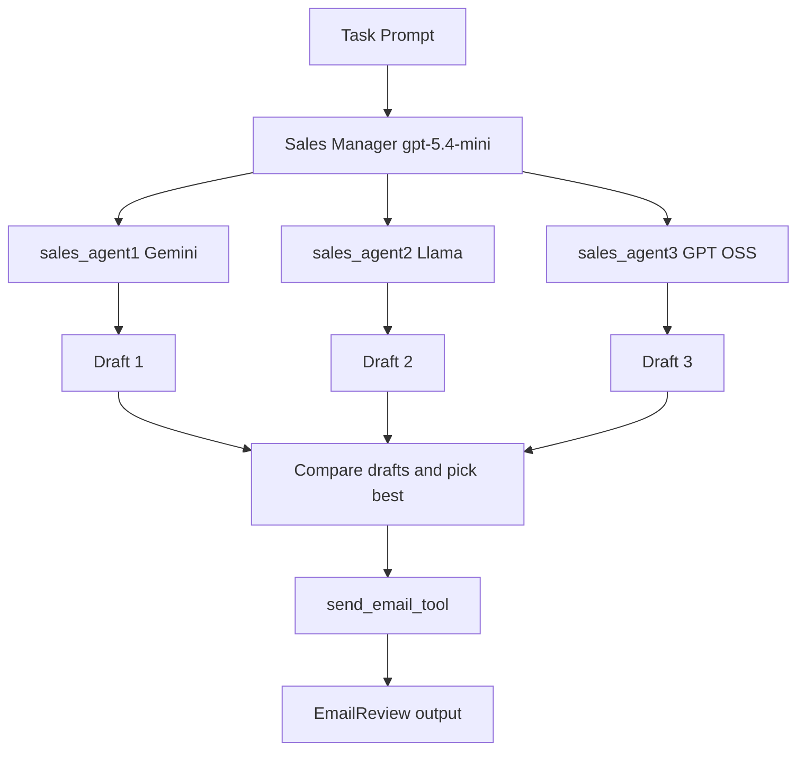

# Multi agent workflow 

## Orchestrating by LLM(Tools)
Let create different sales agents. These agents create emails.

1. Agent 1 -> Gemini Sales Agent
2. Agent 2 -> Llama Sales Agent
3. Agent 3 -> GPT-OSS Sales Agent

Sales Manager Agent. Selects the best email from the available options and send the email
to potential customers.

Sales Manager Agent -> gpt-5.4-mini

## Flow

